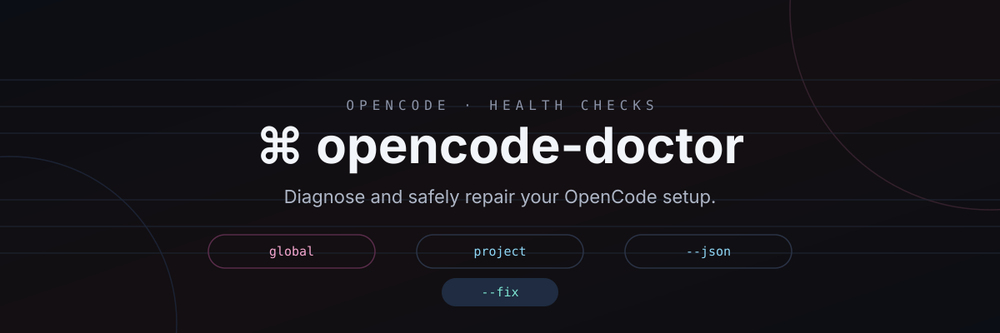

<div align="center">



**Cek kesehatan setup OpenCode kamu — satu perintah, diagnosa dan perbaiki dengan aman.**

Jalankan pemeriksaan diagnostik pada lapisan global `~/.config/opencode` dan
project `.opencode` milikmu, dapatkan laporan dalam bentuk teks atau JSON, dan
biarkan ia memperbaiki masalah yang paling umum — dengan backup terlebih dahulu,
setiap saat.

[](https://github.com/kiraadityaa/opencode-doctor/actions)
[](LICENSE)
[](https://github.com/kiraadityaa/opencode-doctor/releases)
[](CONTRIBUTING.md)
[](CONTRIBUTING.md)
[](https://github.com/kiraadityaa/setup-opencode)

[English](README.md) · **Bahasa Indonesia**

</div>

---

## Apa ini?

`opencode-doctor` adalah CLI diagnostik bash satu-file untuk
[OpenCode](https://opencode.ai). Ia memeriksa dua lapisan setup-mu:

- **Global** — `~/.config/opencode/opencode.json(c)`: sintaks config, ketersediaan
  model, aturan permission, server MCP, sandbox browser, plugin, path skills
  dan referensi instructions.
- **Project** — `.opencode/` plus `AGENTS.md`: parse config, frontmatter
  agent/command, skills project.

Ia melaporkan hasilnya dalam terminal yang mudah dibaca atau JSON ketat, dan
memberikan kode keluar yang bisa dipakai di skrip dan CI:

| Kode keluar | Arti |
|---|---|
| `0` | sehat |
| `1` | peringatan — tinjau item yang tercantum |
| `2` | ada kegagalan — perbaiki dulu sebelum mengandalkan setup |

## Fitur

- **Kedua scope, atau satu** — `--global`, `--project <dir>`, atau `--both` (default).
- **Output yang bisa dibaca atau JSON** — `--json` mengeluarkan laporan JSON
  ketat; default-nya ringkasan manusia dengan skor kesehatan.
- **Perbaikan otomatis yang aman** — `--fix` memperbaiki masalah umum; coba dulu
  dengan `--fix --dry-run`. Setiap perubahan nyata diawali backup
  `.doctor.bak.<timestamp>` dan config divalidasi ulang sebelum ditulis.
- **Tanpa instalasi tambahan** — satu file `doctor.sh` dengan dependensi yang
  sudah kamu punya: `bash`, `python3` (stdlib saja), dan opsional `opencode`.
- **Ramah offline** — `--offline` melewati pengecekan jaringan (dipakai oleh tes).

## Persyaratan

- Linux, macOS, atau WSL
- `bash` (4+)
- `python3`
- `opencode` di `PATH` (opsional untuk cek sintaks config — fallback ke parse file)

## Instalasi

**lewat unduhan rilis (disarankan)**

```bash
curl -fsSLO https://github.com/kiraadityaa/opencode-doctor/releases/latest/download/doctor.sh
chmod +x doctor.sh
./doctor.sh
```

**lewat source**

```bash
git clone https://github.com/kiraadityaa/opencode-doctor
cd opencode-doctor
bash doctor.sh
```

## Mulai cepat

```bash
bash doctor.sh                      # cek lapisan global + project
bash doctor.sh --global --json      # laporan JSON untuk CI/skrip
bash doctor.sh --fix --dry-run      # pratinjau apa yang akan diubah
bash doctor.sh --fix                # terapkan perbaikan aman (backup dulu)
cd my-app && bash doctor.sh --project . --verbose
```

## Penggunaan

```
Usage: doctor.sh [scope] [options]

Scopes:
  --global                cek config global saja
  --project <dir>         cek direktori project saja (mencari .opencode ke atas)
  --both                  cek lapisan global dan project (default)

Options:
  --json                  keluarkan laporan JSON yang bisa dibaca mesin
  --fix                   terapkan perbaikan aman (dengan backup .doctor.bak.<ts>)
  --dry-run               pratinjau perbaikan tanpa menulis apa pun
  --offline               lewati pengecekan jaringan
  --verbose               sertakan check yang lolos di laporan manusia
  -V, --version           cetak versi lalu keluar
  -h, --help              tampilkan bantuan ini lalu keluar

Exit codes:
  0  sehat
  1  ada peringatan
  2  ada kegagalan
```

## Laporan JSON

`--json` mencetak satu dokumen ke stdout. Contoh (dipotong):

```json
{
  "tool": "opencode-doctor",
  "version": "0.1.0",
  "scope": "global",
  "online": true,
  "checks": [
    {
      "id": "g01",
      "severity": "error",
      "status": "OK",
      "name": "config parses",
      "detail": "opencode debug config loaded",
      "remedy": ""
    }
  ],
  "summary": { "total": 23, "ok": 21, "warn": 1, "fail": 1 },
  "score": 87,
  "fixes_applied": [],
  "exit_code": 2
}
```

Check yang dilewati (skip) tidak dicatat, jadi `summary.total` bervariasi sesuai config.

## Cek kesehatan

| Id | Pemeriksaan | Yang dilihat | `--fix` |
|---|---|---|---|
| e01 | binary opencode | `opencode` di PATH | — |
| e02 | versi opencode | rilis GitHub terbaru (lewati dengan `--offline`) | — |
| g01 | config ter-parse | `opencode debug config` atau file | — |
| g02 | model tersedia | `model` / `small_model` vs `opencode models` | — |
| g03 | permission default | aturan catch-all `"*"` di `permission.bash` | ✅ sisipkan `"*": "ask"` |
| g04 | footgun | `rm -rf *`, `git push --force*`, aturan publish | — |
| g05 | binary MCP | executable di belakang server MCP lokal | — |
| g06 | konektivitas MCP | `opencode mcp list` per server yang aktif | — |
| g07 | sandbox browser | `agent-browser` + `--no-sandbox` di VM/container | ✅ tambah `AGENT_BROWSER_ARGS` |
| g08 | path plugin | path di `plugin` | — |
| g09 | path skills | `SKILL.md` dalam kedalaman 3 | — |
| g10 | referensi instructions | file di `instructions` | — |
| g11 | id yang tertimpa | nama agent/command yang bentrok dengan bawaan | — |
| p01 | config project | ter-parse atau ada `.opencode/` | — |
| p02/p03 | frontmatter agent & command | `description:` di `.opencode/agent*` / `command*` | — |
| p04 | skills project | `.opencode/skills/**/SKILL.md` | — |
| p05 | AGENTS.md | ada di root project | — |

## Perbaikan dan backup

`--fix` saat ini bisa memperbaiki dua masalah, dan daftarnya akan terus bertambah:

- **g03** — aturan catch-all hilang: menyisipkan `"*": "ask"` ke `permission.bash`.
- **g07** — sandbox browser hilang: menambahkan
  `"environment": { "AGENT_BROWSER_ARGS": "--no-sandbox" }` ke entri MCP
  `agent-browser` yang terkonfigurasi.

Sebelum perubahan apa pun, config target disalin ke
`opencode.jsonc.doctor.bak.<timestamp>`. Setelah perbaikan ditulis, file
divalidasi ulang dengan `json.tool`; jika tidak lagi ter-parse, backup
dipulihkan otomatis.

Gunakan `--dry-run` (dengan atau tanpa `-v`) untuk melihat persis apa yang akan
dilakukan `--fix` tanpa mengubah apa pun.

## Pengembangan

```bash
bash test/run.sh            # seluruh suite (hermetik, tanpa jaringan)
shellcheck doctor.sh        # lint shell
```

`test/` berisi:

- `lib.sh` — helper: direktori HOME/XDG sementara, penyalin fixture, helper asersi JSON.
- `fixtures/bin/opencode` — shim `opencode` palsu yang merespons
  `debug config` / `models` / `mcp list` dari fixture config.
- `fixtures/bin/agent-browser` — binary tiruan untuk cek browser.
- `fixtures/<name>/xdg/opencode/opencode.jsonc` — config untuk tiap skenario.
- `cases/*.sh` — lima skenario: healthy, bad-jsonc, no-perm-default,
  sandbox-gap, broken-mcp.

Tes tidak pernah menyentuh config asli dan tidak pernah mengakses jaringan.

## Struktur repo

```
opencode-doctor/
├── doctor.sh          # CLI (satu file)
├── VERSION            # versi saat ini
├── test/
│   ├── run.sh         # runner tes
│   ├── lib.sh         # helper tes
│   ├── fixtures/      # opencode + agent-browser palsu + fixture config
│   └── cases/         # asersi skenario
├── assets/banner.svg
└── .github/workflows/ # ci.yml + release.yml
```

## Repositori terkait

- [setup-opencode](https://github.com/kiraadityaa/setup-opencode) — installer
  satu-perintah untuk lingkungan OpenCode yang lengkap. Jalankan
  `opencode-doctor` setelahnya untuk memverifikasi instalasi.
- [opencode-blueprints](https://github.com/kiraadityaa/opencode-blueprints) —
  config `.opencode/` siap pakai per project. Jalankan cek `--project` terhadap
  blueprint ini.

## Berkontribusi

Lihat [CONTRIBUTING.md](CONTRIBUTING.md). Laporkan bug dan ajukan fitur lewat
template issue; semua perubahan diterima.

## Keamanan

Lihat [SECURITY.md](SECURITY.md) untuk cara melaporkan kerentanan.

## Lisensi

[MIT](LICENSE) © kiraadityaa